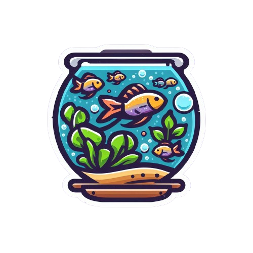
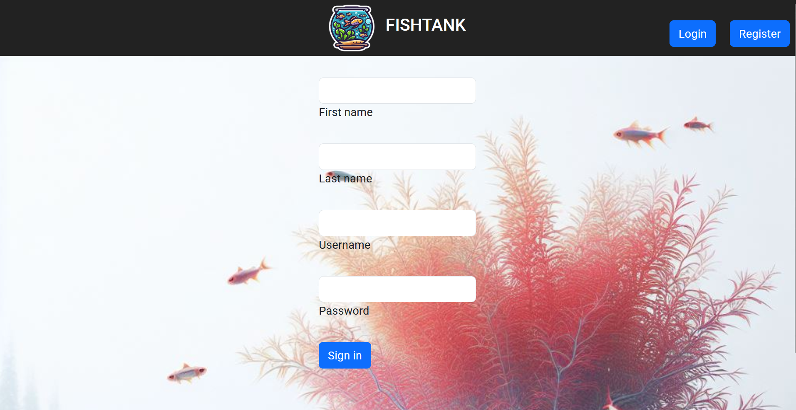
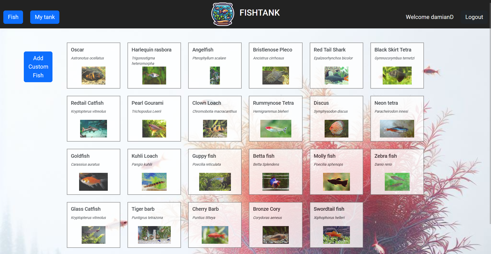
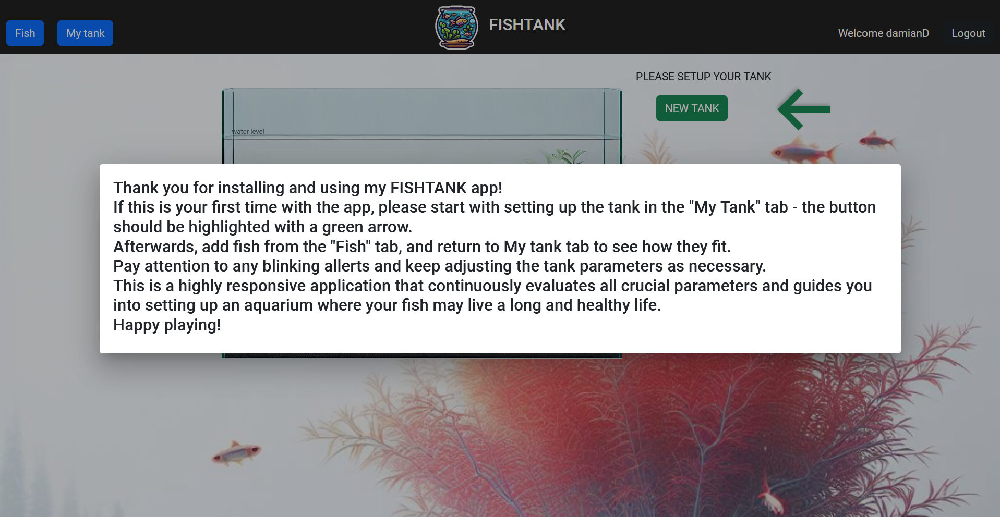
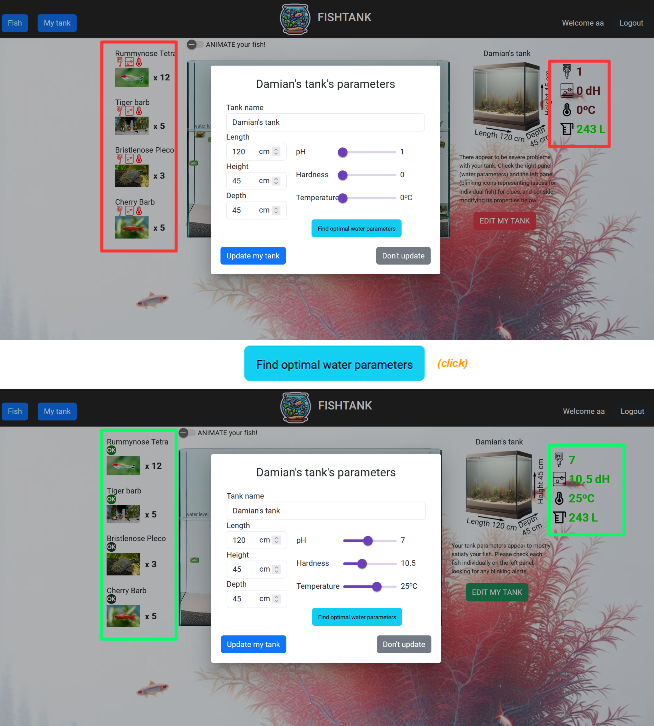
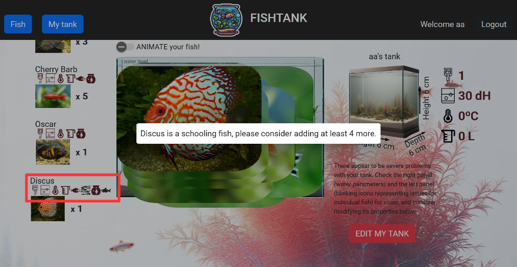
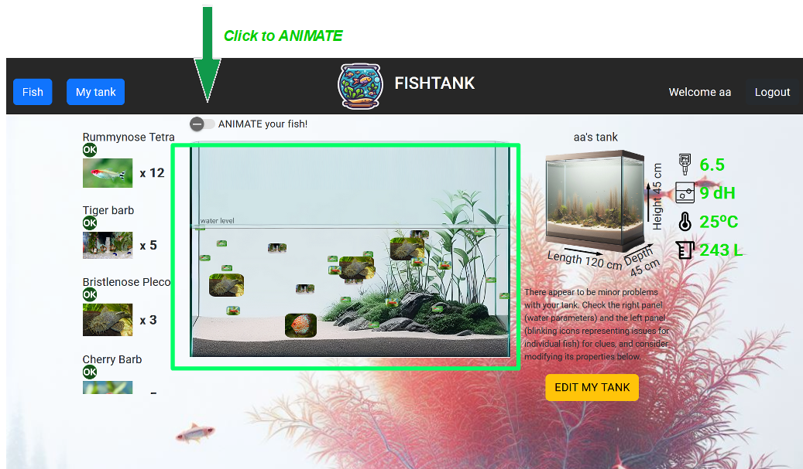

# FISHTANK 

## Instructions

You can start the entire app by simply running the Docker Compose file:
```
docker-compose up
```
Alternatevily, you can initiate the three services separately:

1) Initiate the database:
```
docker run -d -e POSTGRES_HOST_AUTH_METHOD=trust -e POSTGRES_USER=backend -e POSTGRES_PASSWORD=backend -e POSTGRES_DB=backenddb -p 5432:5432 postgres:13
```
2) Start the backend server 
```
cd backend
mvn spring-boot:run
```
3) Start the frontend angular FISHTANK app:
```
cd frontend
npm install
ng serve
```

# Features
### Login and Register Pages 
Multiple users can setup their own tanks. However the fish database is shared (may change in the future depending on user feedback)


### Fish selection
Initially I envisioned simply hooking up the app to external REST API service to obtain a suitably large set of aquarium fish data. However it appears no suitable service exists, therefore I included a small fish database within the app, with the obvious and necessary option to add more fishes to this database by the user. The user will need to supply accurate details for each new fish, to allow the FISHTANK to give back reliable feedback.


### Welcome instructions
Instructions aim to lead the user to the particular order of actions to fully use the app functionality. The order is to setup the tank first, add the desired fish, and then check the My tank tab for alerts on both left and right panels.  The alerts are blinking icons, with the blink rate and color changing with severity of parameter disparity, to catch and focus the attention of the user. 


### Water parameters optimization function 
The "Find optimal water parameters" button loads the optimal water parameters(hardness, temperature, pH) based on requirements of all fishes picked by the user. Note that the found values are averages of all individual fish preferences, and as such will not guarantee that the found value will satisfy every fish, especially those with narrow parameter preference. Manual fine-tuning by the user may be required. Finally, some fishes have too different water parameter preferences, to which a good middle ground value cannot be found. Those fishes should not be kept together.


### Program feedback as visual icons and dialog messages 
The program automatically compares setup fishtank parameters, as well as other fish tankmates, against the preferences of each individual fish, and gives blinking icon alerts if problems are detected. The potential alerts are concerning: water parameter (temperature, water hardness or pH) outside of tolerable range, too small a tank volume, less then 5 fish of one type (if fish prefers to live in a group = schooling), presence of a predator thats at least 3x bigger, presence of an active tankmate that may excessively dominate the shy or delicate fish (common problem with Discus), and finally too small a dimension, either length, depth or height compared to the adult fish length (preferred values are 4x, 1.5x, 1.5x). Clicking the alerts will display dialog windows clarifying what the problem is, ie "the tank pH is 1 unit below the minimum tolerated by the fish".



### Tank visualisation and animation
Tank layout in the middle of My Tank page allows to visualise fish inside the tank that was setup by the user. In particular, it should quickly present to the user if the tank is too small against a particularly large fish (try adding the Redtail Catfish to an average size tank) or particularly overcrowded. There's also an option (turned off by default) to animate each fish in this tank. The animation makes the fish icons move around the swimmable area of the tank, and it's purely cosmetic. It may lead to considerable slowdowns if large number of fishes are added.

